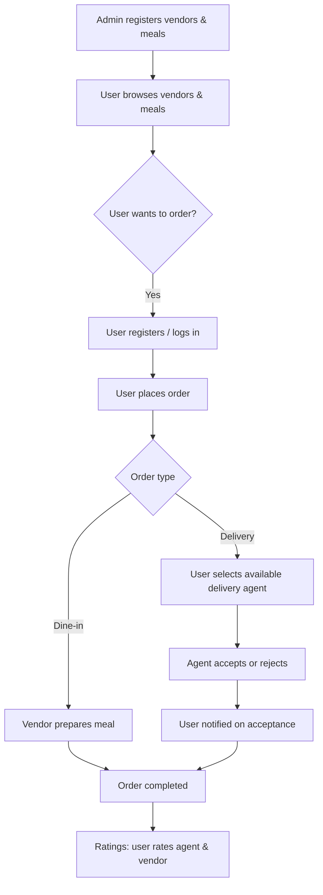

# Mobile Food Ordering & Delivery (University)

A mobile platform for university students to browse campus food vendors, place orders (delivery or dine-in), track order status, and leave ratings. The system connects **Admins**, **Users (Students)**, and **Delivery Agents** in a single workflow.

## What you can do

- Browse cafeterias/cafes/lounges and their meals (before login)
- Register/login to place orders
- Choose delivery or dine-in (use at the cafeteria/lounge)
- Assign an available delivery agent for delivery orders
- Track orders from request to completion
- Get notified when an order is accepted
- Automatic cancellation if no one responds within 10 minutes
- Delivery agent registration + admin approval flow
- Rate delivery agents and cafeterias/lounges after completion (two-way feedback supported)

## Actors

| Actor | Responsibilities |
|---|---|
| Admin | Registers and manages cafeterias/cafes/lounges and meals, approves delivery agents, monitors users/orders/statuses |
| User (Student) | Browses vendors/meals, registers/logs in to order, chooses delivery or dine-in, rates agents and vendors |
| Delivery Agent | Registers for approval, accepts/rejects delivery requests based on availability, notifies customers upon acceptance, receives and gives ratings |

## Core workflow



## Repository structure

- [MyNewApp/](./MyNewApp) — Mobile app (Expo + React Native)
- [backend/](./backend) — Backend API (Node.js + Express + Prisma)
- [TEAM_ASSIGNMENT_AND_COPY_GUIDE.md](./TEAM_ASSIGNMENT_AND_COPY_GUIDE.md) — Team workflow notes

## Getting started

### Backend API

1. Install dependencies

   ```bash
   cd backend
   npm install
   ```

2. Configure environment variables (required)

   The backend expects:
   - `DATABASE_URL`
   - `JWT_SECRET`
   - `PORT` (defaults to `5000`)

3. Start the server

   ```bash
   npm run dev
   ```

### Mobile app

1. Install dependencies

   ```bash
   cd MyNewApp
   npm install
   ```

2. Configure API base URL

   Update `MyNewApp/.env`:
   - `EXPO_PUBLIC_API_URL=http://<your-host>:5000/api`

3. Start the app

   ```bash
   npm run start
   ```

## API documentation

- [backend/ENDPOINTS.md](./backend/ENDPOINTS.md) — Backend API endpoints and auth notes
