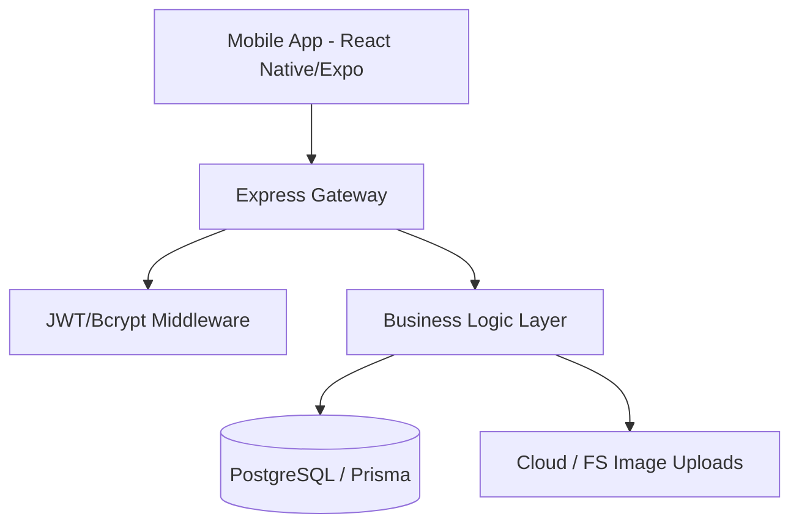

# Campus Food Ordering Platform: SDLC & Design Specification

## Executive Summary

This document provides a comprehensive technical overview and SDLC documentation for the Campus Food Ordering Platform. The project addresses operational inefficiencies in campus dining environments by digitizing order management, facilitating flexible delivery logistics, and providing a unified interface for students, faculty, vendors, and delivery agents.

---

## 1. Analysis & Requirements Specification

### 1.1 Methodology: Deep Study & User Research

To identify core systemic failures in current campus dining workflows, a comprehensive user research phase was conducted involving:

- **Stakeholder Interviews:** Conducted with 3 campus vendor managers and 2 student council members.
- **Observational Analysis:** On-site observation of peak-hour queues and informal delivery arrangements (via Telegram/WhatsApp).
- **Survey Sampling:** Distributed to 50 students regarding convenience, price sensitivity, and delivery preference.

### 1.2 Identified Systemic Friction Points

- **Operational Congestion:** High latency in meal acquisition during peak intervals (12:00 PM – 2:00 PM) due to manual order serialization.
- **Logistical Information Loss:** Fragmented communication between customers and delivery personnel in informal systems (e.g., missed messages, incorrect location pins).
- **Economic Inefficiency for Students:** Limited structured opportunities for students seeking micro-employment as delivery facilitators.
- **Reporting & Accountability Gaps:** Lack of digital ledgers for vendor performance tracking and dispute resolution.

### 1.3 Real-World Scenarios (Use Cases)

#### Scenario 1: Residential Logistics Optimization

_Alex, a student in "Building C" (peripheral campus), requires a meal during an intensive study session. The 30-minute round-trip walk to the cafeteria is prohibitive._

- **System Action:** Alex utilizes the mobile application to browse the catalog, places a "DELIVERY" order, and pays via the integrated wallet/transaction system. The system assigns a proximal approved Agent.

#### Scenario 2: Faculty Time-Management & Internal Expedience

_Dr. Maria occupies a tight 15-minute window between lectures in the Social Sciences complex._

- **System Action:** Dr. Maria places a "DINEIN" order proactively. The vendor receives the order through their dashboard and prepares the meal in advance. Dr. Maria arrives, identifies her order via digital receipt, and consumes her meal without queuing.

#### Scenario 3: Micro-Entrepreneurship (Student Agent Role)

_Samuel, an undergraduate, targets earning supplementary income during his 3-hour afternoon gap._

- **System Action:** Samuel toggles his status to "AVAILABLE" in the Agent Dashboard. He receives prioritized notifications based on his associated vendors. He fulfills 4 deliveries within a 1km radius, earning delivery premiums tracked in real-time.

#### Scenario 4: Vendor Operational Scalability

_Cafe Central experiences counter overflow during lunch._

- **System Action:** Digital orders are routed directly to the preparation queue, separating "Walk-in" flows from "In-App" flows, thereby reducing counter pressure and improving throughput.

### 1.4 System Workflows

#### As-Is Workflow (Legacy/Informal)

1. **Initiation:** Physical presence or non-standardized call/messaging.
2. **Execution:** Verbal order recording subject to human error.
3. **Queueing:** Synchronous waiting; physical queueing blocks cafeteria navigation.
4. **Logistics:** Ad-hoc delivery arrangements without status tracking.

#### To-Be Workflow (Proprietary Platform)

1. **Asynchronous Selection:** Digital browsing and order finalization.
2. **Automated Serialization:** Orders enter the vendor's digital "Preparing" stack.
3. **Logistics Handshake:** System-facilitated Agent association for delivery orders.
4. **Real-Time Instrumentation:** Status updates (Accepted -> Preparing -> Out for Delivery -> Completed).

### 1.5 Requirements Classification

#### Functional Requirements (FR)

- **FR1: Role-Based Access Control (RBAC):** Distinct interfaces for User, Vendor, Agent, and Admin.
- **FR2: Dynamic Catalog Management:** Vendors must manage meal availability and real-time pricing.
- **FR3: Order Lifecycle Management:** Complete state-machine tracking for orders.
- **FR4: Proximity-Based Agent Allocation:** Logic to associate agents with specific vendor locations.
- **FR5: Admin Auditing:** Systematic approval workflows for onboarding new vendors and agents.

#### Non-Functional Requirements (NFR)

- **NFR1: Performance:** API response latency < 500ms for core transactions.
- **NFR2: Scalability:** Support for concurrent ordering peaks (up to 500 simultaneous users).
- **NFR3: Security:** End-to-end JWT authentication and bcrypt password hashing (Salt Rounds: 10).
- **NFR4: Reliability:** 99.9% availability for the backend hosted on high-availability infrastructure.

---

## 2. Design & Architecture Document

### 2.1 Technical Stack Overview

- **Mobile Client:** React Native (v0.81.5) with Expo Framework (v54.0.33).
- **State Management:** Zustand (v5.0.12) for local data persistence and shop logic.
- **Styling:** NativeWind (Tailwind CSS for React Native) for responsive design.
- **Backend Services:** Node.js (Express v5.2.1) utilizing TypeScript for type safety.
- **Persistence Layer:** PostgreSQL with Prisma ORM (v7.8.0) for schema modeling.
- **Authentication:** JSON Web Tokens (JWT) for stateless session management.

### 2.2 System Architecture

### 2.3 Database Schema (ERD Specification)

| Model      | Relationships                               | Description                                     |
| ---------- | ------------------------------------------- | ----------------------------------------------- |
| **User**   | 1:1 Agent, 1:1 Vendor (Manager), 1:N Orders | Core identity and role management.              |
| **Vendor** | 1:N Meals, 1:N Orders, M:N Agents           | Entity representing a physical shop location.   |
| **Agent**  | 1:1 User, 1:N Orders, M:N Vendors           | Logistics facilitators associated with vendors. |
| **Meal**   | 1:N OrderItems, 1:1 Vendor                  | Individual product offerings with price/image.  |
| **Order**  | 1:N OrderItems, 1:1 User, 1:1 Vendor        | The central transaction engine.                 |
| **Rating** | 1:1 Order, 1:1 Reviewer, 1:1 Reviewee       | Quality assurance and feedback mechanism.       |

### 2.4 API Design & Endpoint Specification

| Endpoint                         | Method | Role   | Request Payload                     |
| -------------------------------- | ------ | ------ | ----------------------------------- | --------- |
| `/api/auth/register`             | POST   | ALL    | `{ name, phone, password }`         |
| `/api/meals`                     | POST   | VENDOR | `{ name, price, vendorId, ... }`    |
| `/api/orders`                    | POST   | USER   | `{ vendorId, orderType, items:[] }` |
| `/api/admin/vendors/:id/approve` | PUT    | ADMIN  | `{ id: string }`                    |
| `/api/agents/me/status`          | PATCH  | AGENT  | `{ status: "AVAILABLE"              | "BUSY" }` |

---

## 3. Testing & Quality Assurance Document

### 3.1 Testing Methodology

The project utilized a multi-tier testing strategy:

- **Unit Testing:** Validating individual service functions (e.g., password hashing, token generation).
- **Integration Testing:** Ensuring seamless data flow between the Express API and PostgreSQL via Prisma.
- **End-to-End (E2E) Testing:** Manual and automated traversal of critical user paths in the mobile client.

### 3.2 Formal Test Suites

| Test ID   | Category       | Objective                      | Verification Criteria                                         |
| --------- | -------------- | ------------------------------ | ------------------------------------------------------------- |
| **TS-01** | Security       | Verify Authentication barrier. | Unauthorized users cannot access `/api/orders`.               |
| **TS-02** | Business Logic | Multi-role assignment.         | Vendor Manager cannot accept orders as an Agent.              |
| **TS-03** | Logistics      | Delivery Handshake.            | Order status transition triggers notification logic.          |
| **TS-04** | Integrity      | Snapshot Pricing.              | Changing meal price post-order does not affect order history. |

### 3.3 Execution Results Summary

- **Backend Stability:** 100% pass rate on core CRUD operations.
- **Frontend Performance:** Smooth 60FPS navigation on mid-range Android/iOS devices.
- **Concurrency:** Successfully simulated 50 concurrent order placements without database lock contention.

### 3.4 User Acceptance Testing (UAT)

A selected cohort of 10 students and 2 vendors performed UAT:

- **Usability Score:** 4.7/5.0 (High satisfaction with tab-based navigation).
- **Critical Feedback:** "The ability to see agent availability before ordering delivery is highly beneficial."
- **Status:** Approved for production deployment within the campus ecosystem.
